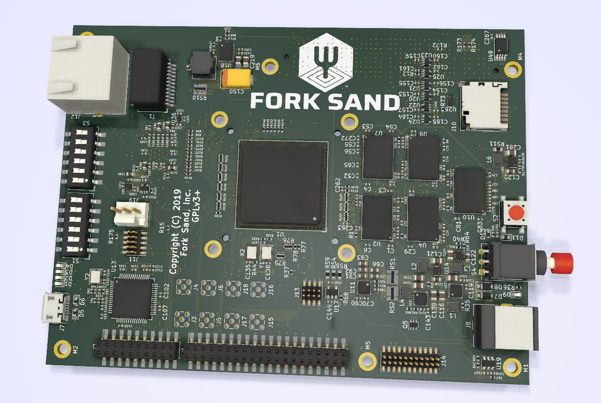
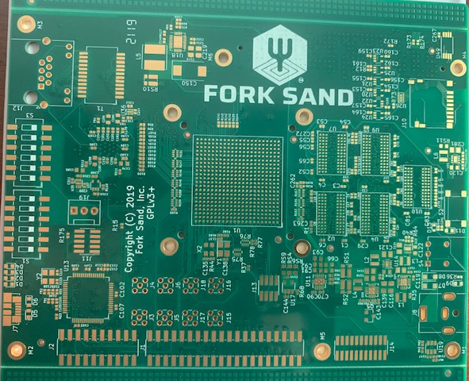
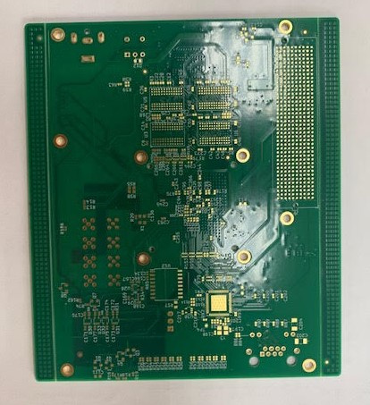

# ki5 RISC-V PCB in KiCAD

The ki5 board is a KiCAD port of SiFive's HiFive Unleashed board for the
RISC-V processor.

First draft done for:

* Ethernet
* FMC Connector
* Power Supply
* USB to UART and JTAG
* Freedom U540 IO and Power
* DDR 4x8 32 bits
* DDR 4x8 32 bit and ECC
* Freedom U540 DDR and Chiplink
* First draft of the Board

It remains to finish and check power circuits for this list.

The second draft, release of the Board in progress.

(C) 2018, 2019, Fork Sand, Inc.
